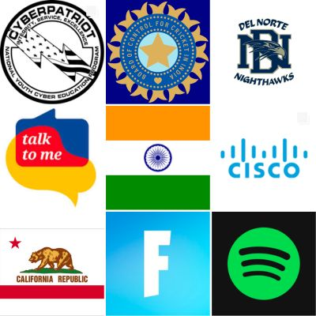

## About Me 
Hi, my name is Ansh. I'm 14 years old and have lived in San Diego my entire life. I'm currently a freshman in Del Norte High School. My family is from India, so Indian culture has been a big part of my life. Like nearly every other Indian in the US, my interests lie in computer sciences, though, I'm slightly oriented towards liberal arts. Outside of school, I enjoy extracurricular and volunteer work. I compete in several team cybersecurity competitions, my job pertaining to network engineering. I'm currently in pursuit of a CCNA certificate to pursue that interest further. As for the volunteering, I teach English to IIT students online and do some backend work for an NGO called "Talk to Me India." 

## Overview of Hacks, Study and Tangibles
Blogging in GitHub pages is a way to learn and code at the same time. 

- Plans, Lists, [Scrum Boards](https://clickup.com/blog/scrum-board/) help you to track key events, show progress and record time.  Effort is a big part of your class grade.  Show plans and time spent!
- [Hacks(Todo)](https://levelup.gitconnected.com/six-ultimate-daily-hacks-for-every-programmer-60f5f10feae) enable you to stay in focus with key requirements of the class.  Each Hack will produce Tangibles.
- Tangibles or [Tangible Artifacts](https://en.wikipedia.org/wiki/Artifact_(software_development)) are things you accumulate as a learner and coder. 
